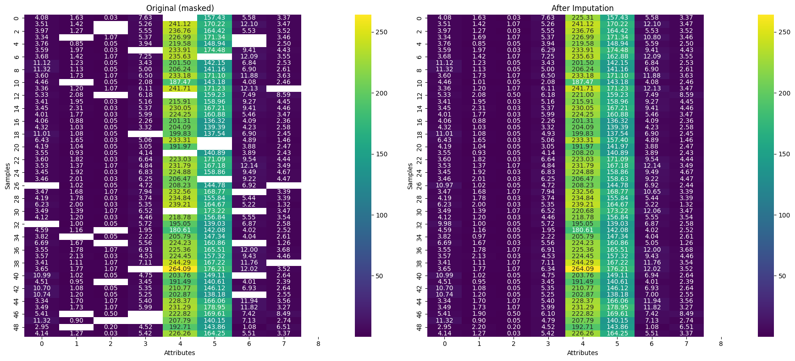
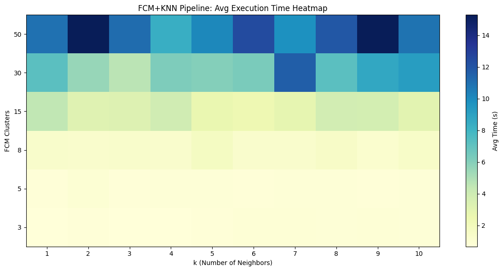
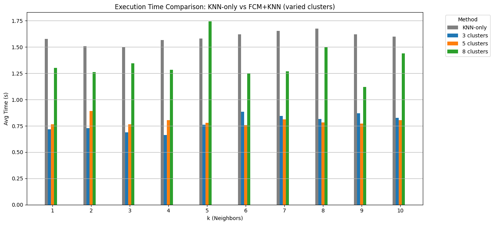
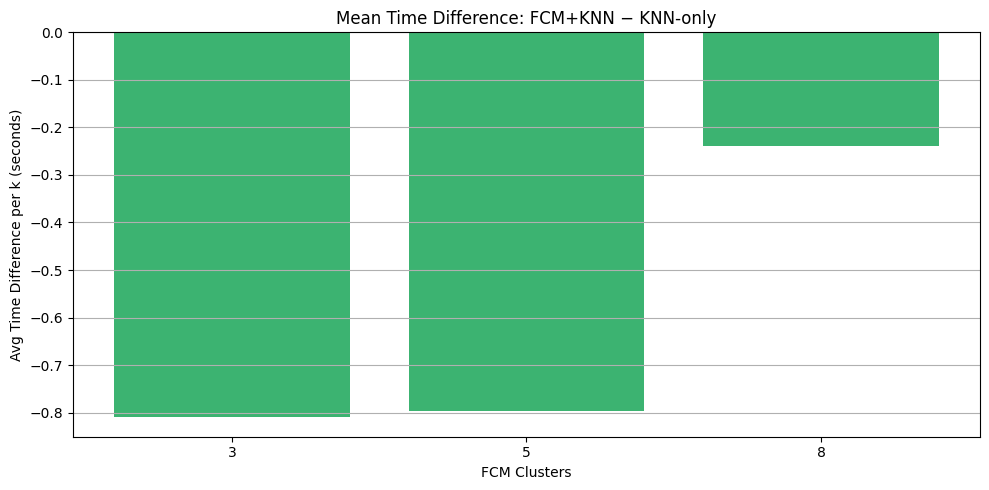
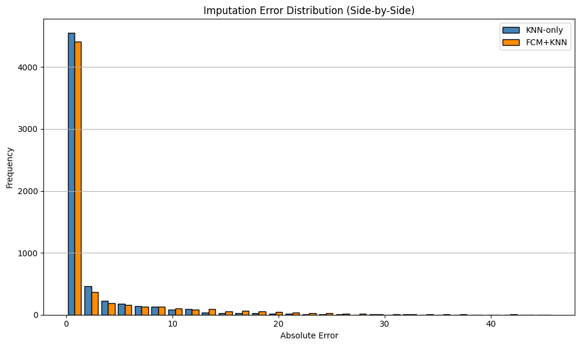

# Accelerating Pure KNN with FCM Clustering

## Overview

This project aims to demonstrate that the traditional **K-Nearest Neighbors (KNN)** algorithm - while quite accurate - can be optimized using a hybrid approach combining **Fuzzy C-Means (FCM)** clustering and **data grouping**. The goal is to preserve or improve classification performance while reducing computational time.

## Key Results

<!-- Replace `images/result1.png` with your actual path -->


Pure KNN method had quite consistent results across the board, almost always over 1.5 seconds.



Using KNN as a baseline, the data is correctly processed and refined.



When using FCM, the processing times varied significantly depending on the number of clusters and the value of *k* in KNN.


A high cluster count often leads to inflated results that fail to represent the practical effectiveness of the FCM+KNN approach.



Reducing the number of clusters yields results that are much more in line with the desired outcomes, highlighting the method's potential.



These results demonstrate that the optimized method can either slighly or drastically reduce computation time while maintaining classification accuracy.



This graph shows that while the FCM-based method is noticeably faster, its decision-making is only slightly less accurate when handling amended values. On average, it also tends to make fewer severe errors.

## Requirements

- Python 3.8+
- common libraries, installed via **JupyterNotebook**

## Setup

#### Setup (Windows)

Extract downloaded source code into a *desired location*.

Create a **Python virtual environment** in the extracted folder:

```powershell
python -m venv .\.venv
```

Open `.ipynb` file (being the Jupyter Notebook) and press **Run All**.

#### Setup (Linux_64-Debian)

Extract downloaded source code into a *desired location*.

Create a **Python virtual environment** in the extracted folder:

```bash
python3 -m venv .venv
```

Open `.ipynb` file (being the Jupyter Notebook) and press **Run All**.

## Troubleshoot

If your Jupiter environment of choice (which might be e.g. <u>VSCode</u>) does not activate `.venv` automatically, you might need to execute one of these commands inside the project folder:

| System    | Command                     |
| --------- | --------------------------- |
| Windows   | ..venv\Scripts\activate.bat |
| Linuxs_64 | source .venv/bin/activate   |

## Authors

- [Jan Supierz](https://github.com/JanSupierz/)

- [Krzysztof Jasiński](https://github.com/xrvr)
